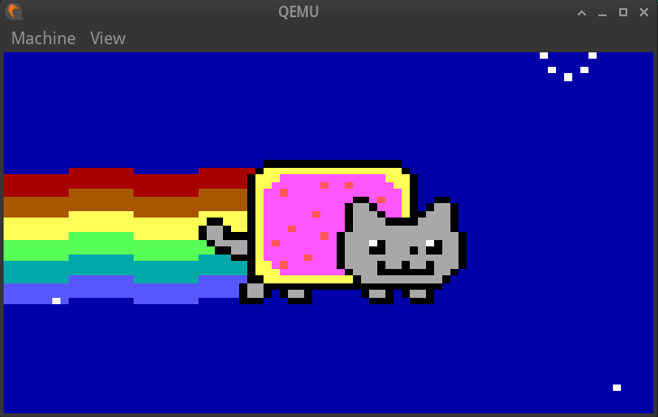

# NyanCat

NyanCat program image extracted from [MEMZ](https://github.com/Da2dalus/The-MALWARE-Repo/blob/master/Trojan/MEMZ.exe)

Run `flash.sh` to write NyanCat to your MBR disk

Write to USB disk and test with QEMU:

```
sudo qemu-system-x86_64 -m 128 -hda /dev/sda
```


